# Class07: Machine Learning
Ryan Bench (PID:A69038034)

Today we will begin our exploration of some “classical” machine learning
approaches. We will start with clustering:

Let’s first make up some data to cluster where we know what the answer
should be.

There is only 1 required function with rnorm, “n”

``` r
hist(rnorm(1000))
```

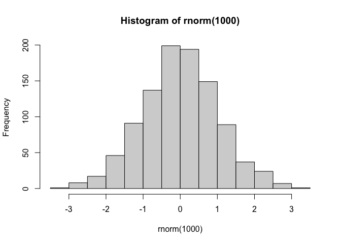

can merge these two norms together by turning them into a vector with c

``` r
x <- c(rnorm(30, mean=-3), rnorm(30, mean=3))
y <- rev(x)

x <- cbind(x, y)
head(x)
```

                 x        y
    [1,] -2.958025 3.628377
    [2,] -3.291031 5.343747
    [3,] -1.570771 2.742799
    [4,] -1.061759 4.968924
    [5,] -2.328520 3.872167
    [6,] -3.724268 2.564956

A peak at x with `plot()`

``` r
plot(x)
```

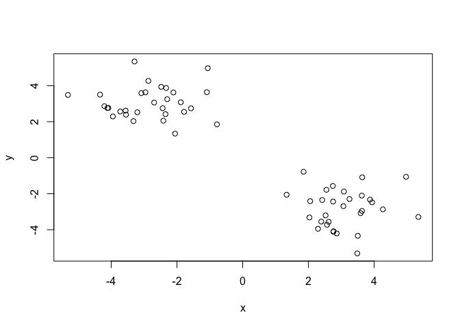

The main function in “base” R for k-means clustering is called
`kmeans()`.

``` r
k <- kmeans(x, centers = 4)
```

> Q. How big are the clusters (i.e. their size)?

``` r
k$size
```

    [1]  8 30 11 11

> Q. What clusters do my data points reside in?

``` r
g <- k$cluster
```

> Q. Can you make a plot of our data colored by cluster assignment -
> i.e. Make a result figure

``` r
plot(x, col = c(g))
points(k$centers, col = "blue", pch = 15)
```

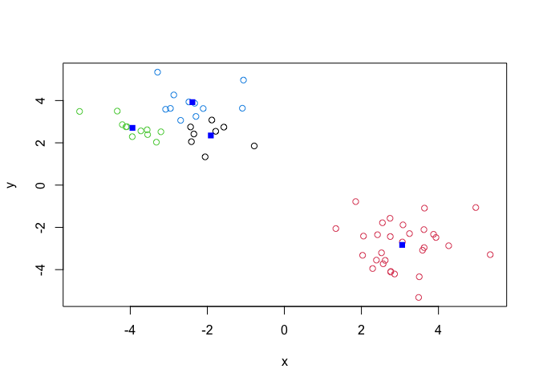

> Q. Cluster with k-means into 4 clusters and plot your results as above

``` r
k4 <- kmeans(x, centers = 4)
plot(x, col = c(g))
points(k4$centers, centers = 4, col = "blue", pch = 15)
```

    Warning in plot.xy(xy.coords(x, y), type = type, ...): "centers" is not a
    graphical parameter

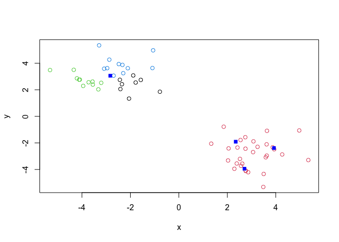

> Q. Run kmeans with center (i.e. values of k) equal 1 to 6

``` r
k1 <- kmeans(x, centers = 1)$tot.withinss
k2 <- kmeans(x, centers = 2)$tot.withinss
k3 <- kmeans(x, centers = 3)$tot.withinss
k4 <- kmeans(x, centers = 4)$tot.withinss
k5 <- kmeans(x, centers = 5)$tot.withinss
k6 <- kmeans(x, centers = 6)$tot.withinss
k7 <- kmeans(x, centers = 7)$tot.withinss

c(k1, k2, k3, k4, k5, k6, k7)
```

    [1] 1152.78073  112.81965   89.18191   76.59822   60.84118   40.38933   36.96873

Or use a for loop

``` r
ans <- NULL
for(i in 1:6) {
  ans <- c(ans, kmeans(x, centers=i)$tot.withinss)
}
ans
```

    [1] 1152.78073  112.81965   89.78348   65.54417   53.57459   40.38933

``` r
plot(ans, typ = "b")
```

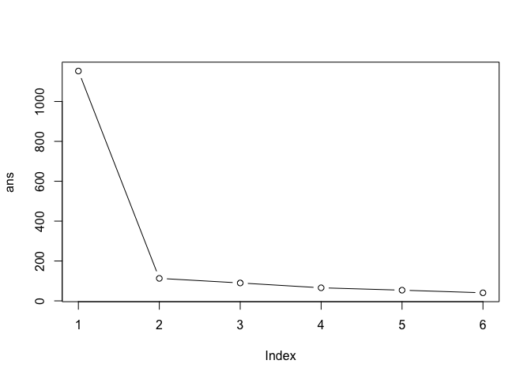

\##Hierarchical Clustering

The main function in “base” R for this is called `hclust()`

``` r
d <- dist(x)
hc <- hclust(d)
hc
```


    Call:
    hclust(d = d)

    Cluster method   : complete 
    Distance         : euclidean 
    Number of objects: 60 

``` r
plot(hc)
abline(h=7, col = "red")
```

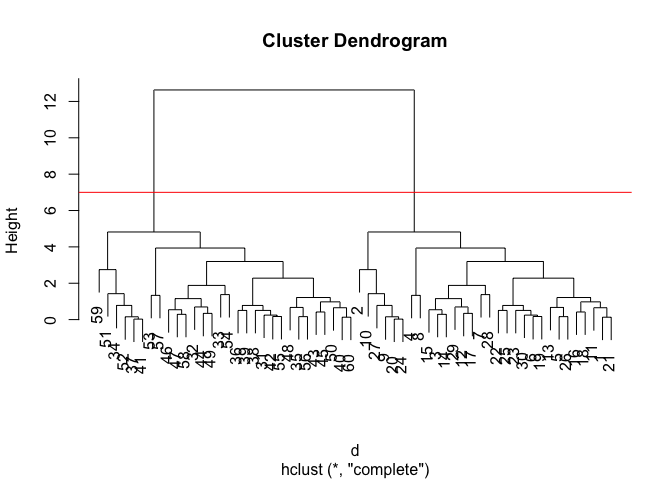

To obtain clusters from our `hclust` result object **hc** we “cut” the
tree to yield different sub branches. For this use the `cutree()`
function

``` r
grps <- cutree(hc, h=7)
grps
```

     [1] 1 1 1 1 1 1 1 1 1 1 1 1 1 1 1 1 1 1 1 1 1 1 1 1 1 1 1 1 1 1 2 2 2 2 2 2 2 2
    [39] 2 2 2 2 2 2 2 2 2 2 2 2 2 2 2 2 2 2 2 2 2 2

Results figure

``` r
plot(x, col=grps)
```

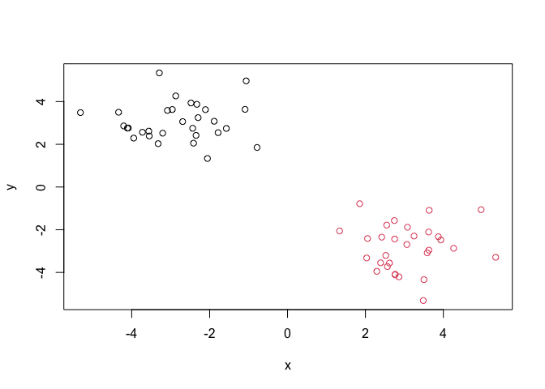

``` r
library(pheatmap)
pheatmap(x)
```


\##Principal Component Analysis (PCA)

``` r
url <- "https://tinyurl.com/UK-foods"
x <- read.csv(url)
nrow(x)
```

    [1] 17

``` r
ncol(x)
```

    [1] 5

> Q1. How many rows and columns are in your new data frame named x? What
> R functions could you use to answer this questions?

There are 17 rows and 5 columns in this data frame. I used nrow() and
ncol()

``` r
head(x)
```

                   X England Wales Scotland N.Ireland
    1         Cheese     105   103      103        66
    2  Carcass_meat      245   227      242       267
    3    Other_meat      685   803      750       586
    4           Fish     147   160      122        93
    5 Fats_and_oils      193   235      184       209
    6         Sugars     156   175      147       139

``` r
# Note how the minus indexing works
rownames(x) <- x[,1]
x <- x[,-1]
head(x)
```

                   England Wales Scotland N.Ireland
    Cheese             105   103      103        66
    Carcass_meat       245   227      242       267
    Other_meat         685   803      750       586
    Fish               147   160      122        93
    Fats_and_oils      193   235      184       209
    Sugars             156   175      147       139

``` r
dim(x)
```

    [1] 17  4

``` r
x <- read.csv(url, row.names=1)
head(x)
```

                   England Wales Scotland N.Ireland
    Cheese             105   103      103        66
    Carcass_meat       245   227      242       267
    Other_meat         685   803      750       586
    Fish               147   160      122        93
    Fats_and_oils      193   235      184       209
    Sugars             156   175      147       139

> Q2. Which approach to solving the ‘row-names problem’ mentioned above
> do you prefer and why? Is one approach more robust than another under
> certain circumstances?

The second method shown above is more robust. Each time you run the code
for the first method, a column gets subtracted, which is not ideal.

\###Spotting major differences and trends

``` r
# Using base R
barplot(as.matrix(x), beside=T, col=rainbow(nrow(x)))
```


> Q3: Changing what optional argument in the above barplot() function
> results in the following plot?

Changing the beside argument to false or taking it away will result in
the different plot.

``` r
library(tidyr)
x_long <- x |> 
          tibble::rownames_to_column("Food") |> 
          pivot_longer(cols = -Food, 
                       names_to = "Country", 
                       values_to = "Consumption")

dim(x_long)
```

    [1] 68  3

``` r
library(ggplot2)
ggplot(x_long) +
  aes(x = Country, y = Consumption, fill = Food) +
  geom_col(position = "dodge") +
  theme_bw()
```


> Q4: Changing what optional argument in the above ggplot() code results
> in a stacked barplot figure?

Deleting the position = “dodge” argument results in a stacked barplot.

> Q5: We can use the pairs() function to generate all pairwise plots for
> our countries. Can you make sense of the following code and resulting
> figure? What does it mean if a given point lies on the diagonal for a
> given plot?

Yes, when a country is listed, when looking at it from the row
orientation, the country is listed on the y axis, but when looking at
them through the column orientation, that is their x axis. When a point
is on the diagonal for a given plot, it means that there is a positive
correlation between the countries being compared and their consumption
patterns for that food.

``` r
pairs(x, col=rainbow(nrow(x)), pch=16)
```


``` r
library(pheatmap)

pheatmap( as.matrix(x) )
```


> Q6. Based on the pairs and heatmap figures, which countries cluster
> together and what does this suggest about their food consumption
> patterns? Can you easily tell what the main differences between N.
> Ireland and the other countries of the UK in terms of this data-set?

It looks like Wales and England are quite similar in their consumption
of these foods. It is still quite difficult to tell what is going on in
the dataset.

\##PCA to the rescue

The main function in “base” R for PCA is called `prcomp()`.

As we want to do PCA on the food data for the different countries we
will want the foods in columns

``` r
pca <- prcomp( t(x) )
summary(pca)
```

    Importance of components:
                                PC1      PC2      PC3     PC4
    Standard deviation     324.1502 212.7478 73.87622 2.7e-14
    Proportion of Variance   0.6744   0.2905  0.03503 0.0e+00
    Cumulative Proportion    0.6744   0.9650  1.00000 1.0e+00

Our result object is called `pca` and it has a `$x` component that we
will look at first

``` r
pca$x
```

                     PC1         PC2        PC3           PC4
    England   -144.99315   -2.532999 105.768945  1.612425e-14
    Wales     -240.52915 -224.646925 -56.475555  4.751043e-13
    Scotland   -91.86934  286.081786 -44.415495 -6.044349e-13
    N.Ireland  477.39164  -58.901862  -4.877895  1.145386e-13

``` r
library(ggplot2)
cols <- c("orange", "red", "blue", "darkgreen")
# Create a data frame for plotting
df <- as.data.frame(pca$x)
df$Country <- rownames(df)

# Plot PC1 vs PC2 with ggplot
ggplot(pca$x) +
  aes(x = PC1, y = PC2, label = rownames(pca$x), color = "cols") +
  geom_point(size = 3) +
  geom_text(vjust = -0.5) +
  xlim(-270, 500) +
  xlab("PC1") +
  ylab("PC2") +
  theme_bw()
```

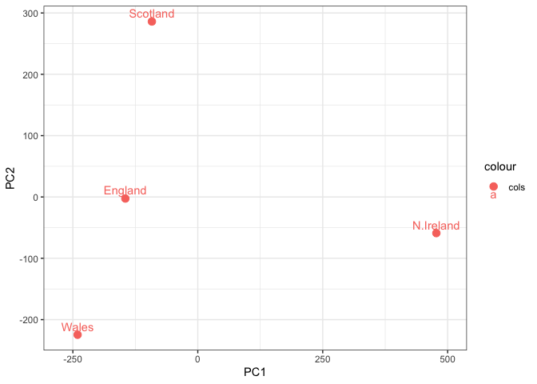

Another major result out of PCA is the so-called “variable loadings” pr
`$rotation` that tells us how the original variables (foods) contribute
to PCs (i.e. our new axis).

``` r
pca$rotation
```

                                 PC1          PC2         PC3          PC4
    Cheese              -0.056955380  0.016012850  0.02394295  0.739145824
    Carcass_meat         0.047927628  0.013915823  0.06367111  0.578851042
    Other_meat          -0.258916658 -0.015331138 -0.55384854 -0.084756407
    Fish                -0.084414983 -0.050754947  0.03906481  0.001282376
    Fats_and_oils       -0.005193623 -0.095388656 -0.12522257  0.012073959
    Sugars              -0.037620983 -0.043021699 -0.03605745  0.011712878
    Fresh_potatoes       0.401402060 -0.715017078 -0.20668248  0.098706764
    Fresh_Veg           -0.151849942 -0.144900268  0.21382237  0.067864113
    Other_Veg           -0.243593729 -0.225450923 -0.05332841  0.017187324
    Processed_potatoes  -0.026886233  0.042850761 -0.07364902  0.020275689
    Processed_Veg       -0.036488269 -0.045451802  0.05289191 -0.013653986
    Fresh_fruit         -0.632640898 -0.177740743  0.40012865  0.088466607
    Cereals             -0.047702858 -0.212599678 -0.35884921  0.201601167
    Beverages           -0.026187756 -0.030560542 -0.04135860 -0.004452115
    Soft_drinks          0.232244140  0.555124311 -0.16942648  0.212426744
    Alcoholic_drinks    -0.463968168  0.113536523 -0.49858320  0.032075763
    Confectionery       -0.029650201  0.005949921 -0.05232164  0.035241822

``` r
ggplot(pca$rotation) + aes(PC1, rownames(pca$rotation)) + geom_col()
```


``` r
pca <- prcomp( t(x) )
summary(pca)
```

    Importance of components:
                                PC1      PC2      PC3     PC4
    Standard deviation     324.1502 212.7478 73.87622 2.7e-14
    Proportion of Variance   0.6744   0.2905  0.03503 0.0e+00
    Cumulative Proportion    0.6744   0.9650  1.00000 1.0e+00

> Q7. Complete the code below to generate a plot of PC1 vs PC2. The
> second line adds text labels over the data points.

``` r
# Create a data frame for plotting
df <- as.data.frame(pca$x)
df$Country <- rownames(df)
country_colors <- c(
  "England" = "orange",
  "Scotland" = "blue",
  "Wales" = "red",
  "Ireland" = "darkgreen")
# Plot PC1 vs PC2 with ggplot
ggplot(pca$x) +
  aes(x = PC1, y = PC2, color = country_colors, label = rownames(pca$x)) +
  geom_point(size = 3) +
  geom_text(vjust = -0.5) +
  xlim(-270, 500) +
  xlab("PC1") +
  ylab("PC2") +
  theme_bw()
```

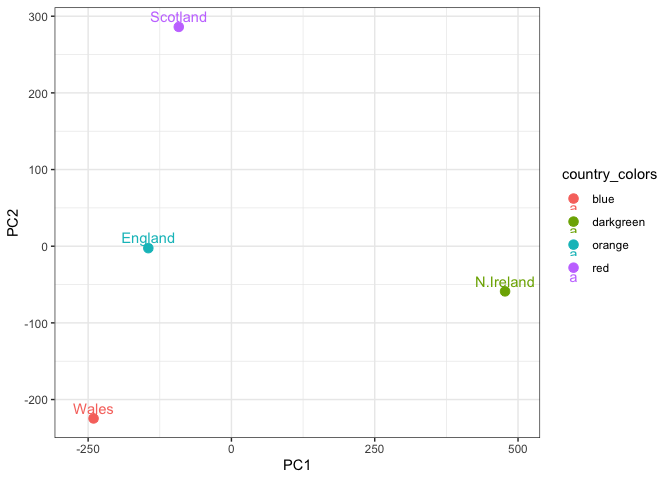

> Q8. Customize your plot so that the colors of the country names match
> the colors in our UK and Ireland map and table at start of this
> document.

I could not get the right colors to appear for the right country for
some reason!

``` r
v <- round( pca$sdev^2/sum(pca$sdev^2) * 100 )
v
```

    [1] 67 29  4  0

``` r
z <- summary(pca)
z$importance
```

                                 PC1       PC2      PC3          PC4
    Standard deviation     324.15019 212.74780 73.87622 2.699876e-14
    Proportion of Variance   0.67444   0.29052  0.03503 0.000000e+00
    Cumulative Proportion    0.67444   0.96497  1.00000 1.000000e+00

``` r
variance_df <- data.frame(
  PC = factor(paste0("PC", 1:length(v)), levels = paste0("PC", 1:length(v))),
  Variance = v
)

ggplot(variance_df) +
  aes(x = PC, y = Variance) +
  geom_col(fill = "steelblue") +
  xlab("Principal Component") +
  ylab("Percent Variation") +
  theme_bw() +
  theme(axis.text.x = element_text(angle = 0))
```

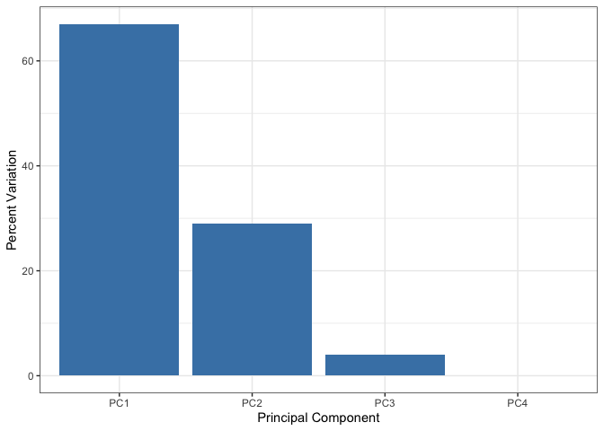

``` r
ggplot(pca$rotation) +
  aes(x = PC1, 
      y = reorder(rownames(pca$rotation), PC1)) +
  geom_col(fill = "steelblue") +
  xlab("PC1 Loading Score") +
  ylab("") +
  theme_bw() +
  theme(axis.text.y = element_text(size = 9))
```


``` r
ggplot(pca$rotation) +
  aes(x = PC2, 
      y = reorder(rownames(pca$rotation), PC1)) +
  geom_col(fill = "steelblue") +
  xlab("PC2 Loading Score") +
  ylab("") +
  theme_bw() +
  theme(axis.text.y = element_text(size = 9))
```

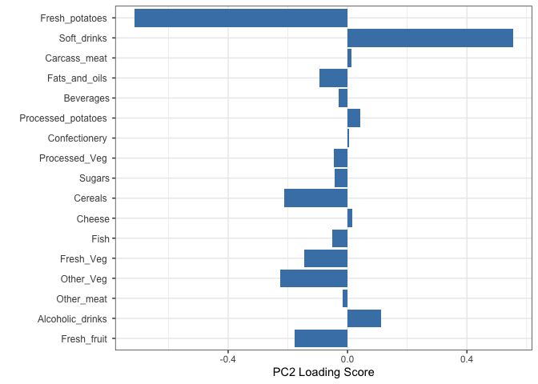

> Q9: Generate a similar ‘loadings plot’ for PC2. What two food groups
> feature prominantely and what does PC2 maninly tell us about?

Fresh potatoes and soft drinks are predominantly featured in PC2. This
means that PC2 will tell us mainly about diets low in fresh potatoes and
high in soft drinks.

``` r
url2 <- "https://tinyurl.com/expression-CSV"
rna.data <- read.csv(url2, row.names=1)
head(rna.data)
```

           wt1 wt2  wt3  wt4 wt5 ko1 ko2 ko3 ko4 ko5
    gene1  439 458  408  429 420  90  88  86  90  93
    gene2  219 200  204  210 187 427 423 434 433 426
    gene3 1006 989 1030 1017 973 252 237 238 226 210
    gene4  783 792  829  856 760 849 856 835 885 894
    gene5  181 249  204  244 225 277 305 272 270 279
    gene6  460 502  491  491 493 612 594 577 618 638

> Q9: How many genes and samples are in this data set?

There are 100 genes and 10 samples.

``` r
pca <- prcomp(t(rna.data), scale=TRUE)

# Create data frame for plotting
df <- as.data.frame(pca$x)
df$Sample <- rownames(df)

## Plot with ggplot
ggplot(df) +
  aes(x = PC1, y = PC2, label = Sample) +
  geom_point(size = 3) +
  geom_text(vjust = -0.5, size = 3) +
  xlab("PC1") +
  ylab("PC2") +
  theme_bw()
```


``` r
summary(pca)
```

    Importance of components:
                              PC1    PC2     PC3     PC4     PC5     PC6     PC7
    Standard deviation     9.6237 1.5198 1.05787 1.05203 0.88062 0.82545 0.80111
    Proportion of Variance 0.9262 0.0231 0.01119 0.01107 0.00775 0.00681 0.00642
    Cumulative Proportion  0.9262 0.9493 0.96045 0.97152 0.97928 0.98609 0.99251
                               PC8     PC9     PC10
    Standard deviation     0.62065 0.60342 3.39e-15
    Proportion of Variance 0.00385 0.00364 0.00e+00
    Cumulative Proportion  0.99636 1.00000 1.00e+00

``` r
pca.var <- pca$sdev^2
pca.var.per <- round(pca.var/sum(pca.var)*100, 1)

# Create scree plot data
scree_df <- data.frame(
  PC = factor(paste0("PC", 1:10), levels = paste0("PC", 1:10)),
  Variance = pca.var[1:10]
)

ggplot(scree_df) +
  aes(x = PC, y = Variance) +
  geom_col(fill = "steelblue") +
  ggtitle("Quick scree plot") +
  xlab("Principal Component") +
  ylab("Variance") +
  theme_bw()
```


``` r
pca.var.per
```

     [1] 92.6  2.3  1.1  1.1  0.8  0.7  0.6  0.4  0.4  0.0

``` r
scree_pct_df <- data.frame(
  PC = factor(paste0("PC", 1:10), levels = paste0("PC", 1:10)),
  PercentVariation = pca.var.per[1:10]
)

ggplot(scree_pct_df) +
  aes(x = PC, y = PercentVariation) +
  geom_col(fill = "steelblue") +
  ggtitle("Scree Plot") +
  xlab("Principal Component") +
  ylab("Percent Variation") +
  theme_bw()
```


``` r
colvec <- colnames(rna.data)
colvec[grep("wt", colvec)] <- "red"
colvec[grep("ko", colvec)] <- "blue"

# Add condition to data frame
df$condition <- substr(df$Sample, 1, 2)
df$color <- colvec

ggplot(df) +
  aes(x = PC1, y = PC2, color = color, label = Sample) +
  geom_point(size = 3) +
  geom_text(vjust = -0.5, hjust = 0.5, show.legend = FALSE) +
  scale_color_identity() +
  xlab(paste0("PC1 (", pca.var.per[1], "%)")) +
  ylab(paste0("PC2 (", pca.var.per[2], "%)")) +
  theme_bw()
```


