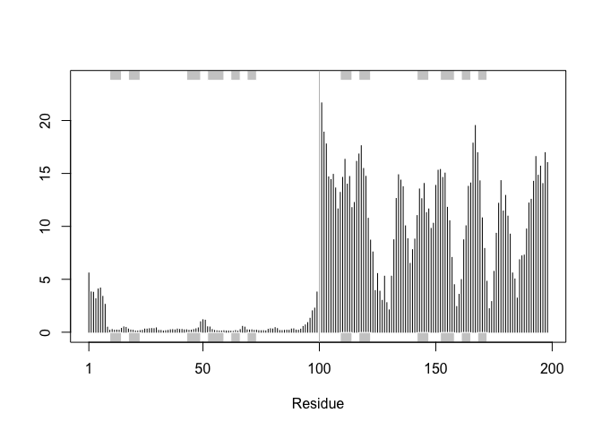

# class11 structural bioinformatics pt.2
Ryan Bench

\##Background

We saw last day that the PDB has 209,886 entries (Oct/Nov 2025).
UniProtKB (i.e. protein sequence database) has 199,579,901 entries.

``` r
209886/199579901*100
```

    [1] 0.1051639

So the PDB has only 0.1% coverage of the main sequence database.

Enter AlphaFold data base (AFDB) \< https://alphafold.ebi.ac.uk/ \> that
attempts to provide computed models for all sequences in UniProt.

AlphaFold DB provides open access to over 200 million protein structure
predictions to accelerate scientific research.

## AlphaFold

AlphaFold has 3 main outputs

- the predicted coordinates (PDB Files)
- A local quality score called **pLDDT** (one for each amino-acid)
- A second quality score **PAE** Predicted Aligned Error (for each pair
  of amino-acid)

We can run AlphaFold ourselves if we are not happy with AFDB (i.e. no
coverage or poor model)

## Interpreting/analyzing AF results in R

``` r
results_dir <- "HIVPR_dimer_23119/"
```

``` r
pdb_files <- list.files(path=results_dir, pattern="*.pdb",full.names = TRUE)

# Print our PDB file names
basename(pdb_files)
```

    [1] "HIVPR_dimer_23119_unrelaxed_rank_001_alphafold2_multimer_v3_model_4_seed_000.pdb"
    [2] "HIVPR_dimer_23119_unrelaxed_rank_002_alphafold2_multimer_v3_model_1_seed_000.pdb"
    [3] "HIVPR_dimer_23119_unrelaxed_rank_003_alphafold2_multimer_v3_model_5_seed_000.pdb"
    [4] "HIVPR_dimer_23119_unrelaxed_rank_004_alphafold2_multimer_v3_model_2_seed_000.pdb"
    [5] "HIVPR_dimer_23119_unrelaxed_rank_005_alphafold2_multimer_v3_model_3_seed_000.pdb"

``` r
library(bio3d)

# Read all data from Models 
#  and superpose/fit coords
pdbs <- pdbaln(pdb_files, fit=TRUE, exefile="msa")
```

    Reading PDB files:
    HIVPR_dimer_23119//HIVPR_dimer_23119_unrelaxed_rank_001_alphafold2_multimer_v3_model_4_seed_000.pdb
    HIVPR_dimer_23119//HIVPR_dimer_23119_unrelaxed_rank_002_alphafold2_multimer_v3_model_1_seed_000.pdb
    HIVPR_dimer_23119//HIVPR_dimer_23119_unrelaxed_rank_003_alphafold2_multimer_v3_model_5_seed_000.pdb
    HIVPR_dimer_23119//HIVPR_dimer_23119_unrelaxed_rank_004_alphafold2_multimer_v3_model_2_seed_000.pdb
    HIVPR_dimer_23119//HIVPR_dimer_23119_unrelaxed_rank_005_alphafold2_multimer_v3_model_3_seed_000.pdb
    .....

    Extracting sequences

    pdb/seq: 1   name: HIVPR_dimer_23119//HIVPR_dimer_23119_unrelaxed_rank_001_alphafold2_multimer_v3_model_4_seed_000.pdb 
    pdb/seq: 2   name: HIVPR_dimer_23119//HIVPR_dimer_23119_unrelaxed_rank_002_alphafold2_multimer_v3_model_1_seed_000.pdb 
    pdb/seq: 3   name: HIVPR_dimer_23119//HIVPR_dimer_23119_unrelaxed_rank_003_alphafold2_multimer_v3_model_5_seed_000.pdb 
    pdb/seq: 4   name: HIVPR_dimer_23119//HIVPR_dimer_23119_unrelaxed_rank_004_alphafold2_multimer_v3_model_2_seed_000.pdb 
    pdb/seq: 5   name: HIVPR_dimer_23119//HIVPR_dimer_23119_unrelaxed_rank_005_alphafold2_multimer_v3_model_3_seed_000.pdb 

``` r
rd <- rmsd(pdbs, fit=T)
```

    Warning in rmsd(pdbs, fit = T): No indices provided, using the 198 non NA positions

``` r
range(rd)
```

    [1]  0.000 14.754

``` r
library(pheatmap)

colnames(rd) <- paste0("m",1:5)
rownames(rd) <- paste0("m",1:5)
pheatmap(rd)
```


``` r
pdb <- read.pdb("1hsg")
```

      Note: Accessing on-line PDB file

``` r
plotb3(pdbs$b[1,], typ="l", lwd=2, sse=pdb)
points(pdbs$b[2,], typ="l", col="red")
points(pdbs$b[3,], typ="l", col="blue")
points(pdbs$b[4,], typ="l", col="darkgreen")
points(pdbs$b[5,], typ="l", col="orange")
abline(v=100, col="gray")
```


``` r
core <- core.find(pdbs)
```

     core size 197 of 198  vol = 9885.822 
     core size 196 of 198  vol = 6896.71 
     core size 195 of 198  vol = 1337.847 
     core size 194 of 198  vol = 1040.67 
     core size 193 of 198  vol = 951.857 
     core size 192 of 198  vol = 899.083 
     core size 191 of 198  vol = 834.732 
     core size 190 of 198  vol = 771.338 
     core size 189 of 198  vol = 733.065 
     core size 188 of 198  vol = 697.28 
     core size 187 of 198  vol = 659.742 
     core size 186 of 198  vol = 625.273 
     core size 185 of 198  vol = 589.541 
     core size 184 of 198  vol = 568.253 
     core size 183 of 198  vol = 545.015 
     core size 182 of 198  vol = 512.889 
     core size 181 of 198  vol = 490.723 
     core size 180 of 198  vol = 470.266 
     core size 179 of 198  vol = 450.731 
     core size 178 of 198  vol = 434.735 
     core size 177 of 198  vol = 420.337 
     core size 176 of 198  vol = 406.658 
     core size 175 of 198  vol = 393.334 
     core size 174 of 198  vol = 382.395 
     core size 173 of 198  vol = 372.858 
     core size 172 of 198  vol = 356.994 
     core size 171 of 198  vol = 346.567 
     core size 170 of 198  vol = 337.446 
     core size 169 of 198  vol = 326.659 
     core size 168 of 198  vol = 314.95 
     core size 167 of 198  vol = 304.127 
     core size 166 of 198  vol = 294.552 
     core size 165 of 198  vol = 285.648 
     core size 164 of 198  vol = 278.884 
     core size 163 of 198  vol = 266.765 
     core size 162 of 198  vol = 258.994 
     core size 161 of 198  vol = 247.723 
     core size 160 of 198  vol = 239.84 
     core size 159 of 198  vol = 234.963 
     core size 158 of 198  vol = 230.062 
     core size 157 of 198  vol = 221.985 
     core size 156 of 198  vol = 215.62 
     core size 155 of 198  vol = 206.793 
     core size 154 of 198  vol = 196.984 
     core size 153 of 198  vol = 188.539 
     core size 152 of 198  vol = 182.262 
     core size 151 of 198  vol = 176.954 
     core size 150 of 198  vol = 170.712 
     core size 149 of 198  vol = 166.119 
     core size 148 of 198  vol = 159.796 
     core size 147 of 198  vol = 153.767 
     core size 146 of 198  vol = 149.092 
     core size 145 of 198  vol = 143.657 
     core size 144 of 198  vol = 137.138 
     core size 143 of 198  vol = 132.517 
     core size 142 of 198  vol = 127.231 
     core size 141 of 198  vol = 121.574 
     core size 140 of 198  vol = 116.775 
     core size 139 of 198  vol = 112.57 
     core size 138 of 198  vol = 108.17 
     core size 137 of 198  vol = 105.133 
     core size 136 of 198  vol = 101.249 
     core size 135 of 198  vol = 97.374 
     core size 134 of 198  vol = 92.974 
     core size 133 of 198  vol = 88.184 
     core size 132 of 198  vol = 84.029 
     core size 131 of 198  vol = 81.898 
     core size 130 of 198  vol = 78.019 
     core size 129 of 198  vol = 75.272 
     core size 128 of 198  vol = 73.052 
     core size 127 of 198  vol = 70.695 
     core size 126 of 198  vol = 68.975 
     core size 125 of 198  vol = 66.694 
     core size 124 of 198  vol = 64.394 
     core size 123 of 198  vol = 62.092 
     core size 122 of 198  vol = 59.045 
     core size 121 of 198  vol = 56.629 
     core size 120 of 198  vol = 54.016 
     core size 119 of 198  vol = 51.806 
     core size 118 of 198  vol = 49.652 
     core size 117 of 198  vol = 48.193 
     core size 116 of 198  vol = 46.648 
     core size 115 of 198  vol = 44.752 
     core size 114 of 198  vol = 43.292 
     core size 113 of 198  vol = 41.093 
     core size 112 of 198  vol = 39.147 
     core size 111 of 198  vol = 36.472 
     core size 110 of 198  vol = 34.117 
     core size 109 of 198  vol = 31.47 
     core size 108 of 198  vol = 29.448 
     core size 107 of 198  vol = 27.325 
     core size 106 of 198  vol = 25.822 
     core size 105 of 198  vol = 24.15 
     core size 104 of 198  vol = 22.648 
     core size 103 of 198  vol = 21.069 
     core size 102 of 198  vol = 19.953 
     core size 101 of 198  vol = 18.3 
     core size 100 of 198  vol = 15.723 
     core size 99 of 198  vol = 14.841 
     core size 98 of 198  vol = 11.646 
     core size 97 of 198  vol = 9.434 
     core size 96 of 198  vol = 7.354 
     core size 95 of 198  vol = 6.179 
     core size 94 of 198  vol = 5.666 
     core size 93 of 198  vol = 4.705 
     core size 92 of 198  vol = 3.665 
     core size 91 of 198  vol = 2.77 
     core size 90 of 198  vol = 2.151 
     core size 89 of 198  vol = 1.715 
     core size 88 of 198  vol = 1.15 
     core size 87 of 198  vol = 0.874 
     core size 86 of 198  vol = 0.685 
     core size 85 of 198  vol = 0.528 
     core size 84 of 198  vol = 0.37 
     FINISHED: Min vol ( 0.5 ) reached

``` r
core.inds <- print(core, vol=0.5)
```

    # 85 positions (cumulative volume <= 0.5 Angstrom^3) 
      start end length
    1     9  49     41
    2    52  95     44

``` r
xyz <- pdbfit(pdbs, core.inds, outpath="corefit_structures")
```

``` r
rf <- rmsf(xyz)

plotb3(rf, sse=pdb)
abline(v=100, col="gray", ylab="RMSF")
```



``` r
library(jsonlite)

# Listing of all PAE JSON files
pae_files <- list.files(path=results_dir,
                        pattern=".*model.*\\.json",
                        full.names = TRUE)
```

``` r
pae1 <- read_json(pae_files[1],simplifyVector = TRUE)
pae5 <- read_json(pae_files[5],simplifyVector = TRUE)

attributes(pae1)
```

    $names
    [1] "plddt"   "max_pae" "pae"     "ptm"     "iptm"   

``` r
head(pae1$plddt) 
```

    [1] 90.81 93.25 93.69 92.88 95.25 89.44

``` r
pae1$max_pae
```

    [1] 12.84375

``` r
pae5$max_pae
```

    [1] 29.59375

``` r
plot.dmat(pae1$pae, 
          xlab="Residue Position (i)",
          ylab="Residue Position (j)")
```


``` r
plot.dmat(pae5$pae, 
          xlab="Residue Position (i)",
          ylab="Residue Position (j)",
          grid.col = "black",
          zlim=c(0,30))
```


``` r
plot.dmat(pae1$pae, 
          xlab="Residue Position (i)",
          ylab="Residue Position (j)",
          grid.col = "black",
          zlim=c(0,30))
```


``` r
aln_file <- list.files(path=results_dir,
                       pattern=".a3m$",
                        full.names = TRUE)
aln_file
```

    [1] "HIVPR_dimer_23119//HIVPR_dimer_23119.a3m"

``` r
aln <- read.fasta(aln_file[1], to.upper = TRUE)
```

    [1] " ** Duplicated sequence id's: 101 **"
    [2] " ** Duplicated sequence id's: 101 **"

``` r
dim(aln$ali)
```

    [1] 5397  132

``` r
sim <- conserv(aln)
```

``` r
plotb3(sim[1:99], sse=trim.pdb(pdb, chain="A"),
       ylab="Conservation Score")
```


``` r
con <- consensus(aln, cutoff = 0.9)
con$seq
```

      [1] "-" "-" "-" "-" "-" "-" "-" "-" "-" "-" "-" "-" "-" "-" "-" "-" "-" "-"
     [19] "-" "-" "-" "-" "-" "-" "D" "T" "G" "A" "-" "-" "-" "-" "-" "-" "-" "-"
     [37] "-" "-" "-" "-" "-" "-" "-" "-" "-" "-" "-" "-" "-" "-" "-" "-" "-" "-"
     [55] "-" "-" "-" "-" "-" "-" "-" "-" "-" "-" "-" "-" "-" "-" "-" "-" "-" "-"
     [73] "-" "-" "-" "-" "-" "-" "-" "-" "-" "-" "-" "-" "-" "-" "-" "-" "-" "-"
     [91] "-" "-" "-" "-" "-" "-" "-" "-" "-" "-" "-" "-" "-" "-" "-" "-" "-" "-"
    [109] "-" "-" "-" "-" "-" "-" "-" "-" "-" "-" "-" "-" "-" "-" "-" "-" "-" "-"
    [127] "-" "-" "-" "-" "-" "-"

``` r
m1.pdb <- read.pdb(pdb_files[1])
occ <- vec2resno(c(sim[1:99], sim[1:99]), m1.pdb$atom$resno)
write.pdb(m1.pdb, o=occ, file="m1_conserv.pdb")
```
