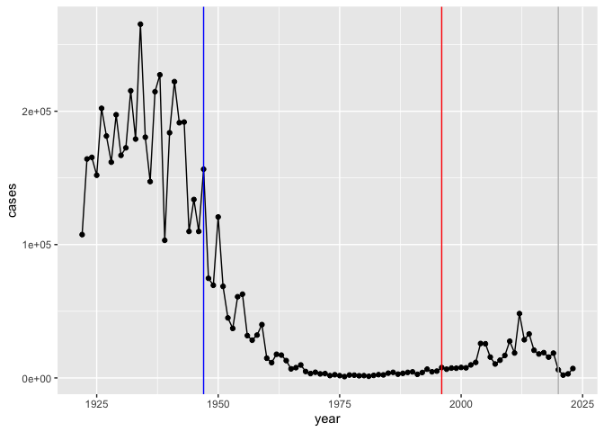
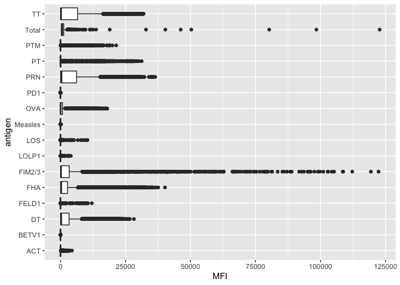
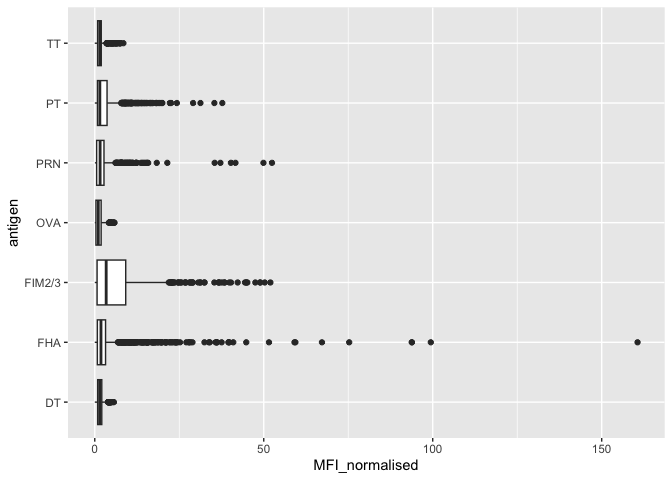
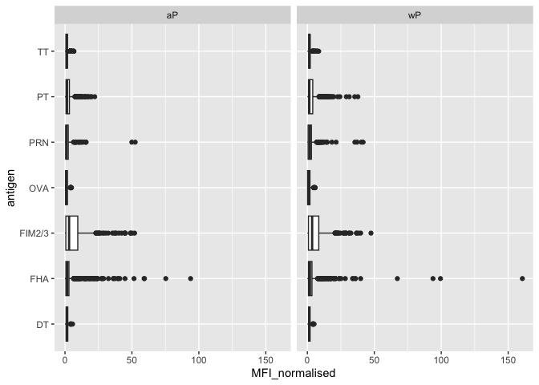
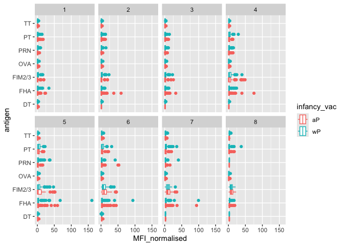
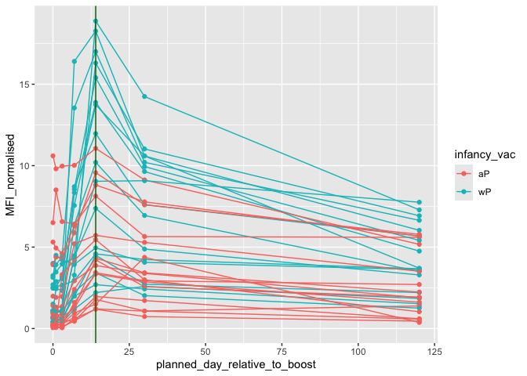

# class_19_mini_project
Ryan Bench (PID: A69038034)

- [Background](#background)
- [The CMI-PB Project](#the-cmi-pb-project)
- [Focus in IgG](#focus-in-igg)
  - [Differences between aP and wP?](#differences-between-ap-and-wp)
  - [Time course analysis](#time-course-analysis)
- [Time course of PT (Virulence Factor: Pertussis
  Toxin)](#time-course-of-pt-virulence-factor-pertussis-toxin)
- [System setup](#system-setup)

## Background

Pertussis aka whooping cough, is a highly contagious lung infection
caused by the bacteria *Bordetella pertussis*.

The CDC tracks case data online and in the US the data is available on
their website:
https://www.cdc.gov/pertussis/php/surveillance/pertussis-cases-by-year.html

``` r
cdc <- data.frame(
  year = c(1922L,1923L,1924L,1925L,
           1926L,1927L,1928L,1929L,1930L,1931L,
           1932L,1933L,1934L,1935L,1936L,
           1937L,1938L,1939L,1940L,1941L,1942L,
           1943L,1944L,1945L,1946L,1947L,
           1948L,1949L,1950L,1951L,1952L,
           1953L,1954L,1955L,1956L,1957L,1958L,
           1959L,1960L,1961L,1962L,1963L,
           1964L,1965L,1966L,1967L,1968L,1969L,
           1970L,1971L,1972L,1973L,1974L,
           1975L,1976L,1977L,1978L,1979L,1980L,
           1981L,1982L,1983L,1984L,1985L,
           1986L,1987L,1988L,1989L,1990L,
           1991L,1992L,1993L,1994L,1995L,1996L,
           1997L,1998L,1999L,2000L,2001L,
           2002L,2003L,2004L,2005L,2006L,2007L,
           2008L,2009L,2010L,2011L,2012L,
           2013L,2014L,2015L,2016L,2017L,2018L,
           2019L,2020L,2021L,2022L,2023L),
  cases = c(107473,164191,165418,152003,
            202210,181411,161799,197371,
            166914,172559,215343,179135,265269,
            180518,147237,214652,227319,103188,
            183866,222202,191383,191890,109873,
            133792,109860,156517,74715,69479,
            120718,68687,45030,37129,60886,
            62786,31732,28295,32148,40005,
            14809,11468,17749,17135,13005,6799,
            7717,9718,4810,3285,4249,3036,
            3287,1759,2402,1738,1010,2177,2063,
            1623,1730,1248,1895,2463,2276,
            3589,4195,2823,3450,4157,4570,
            2719,4083,6586,4617,5137,7796,6564,
            7405,7298,7867,7580,9771,11647,
            25827,25616,15632,10454,13278,
            16858,27550,18719,48277,28639,32971,
            20762,17972,18975,15609,18617,
            6124,2116,3044,7063)
)
```

> Q1. Make a plot of Pertussis cases per year with ggplot

``` r
library(ggplot2)
ggplot(cdc, aes(x=year, y=cases)) +
  geom_point() + geom_line()
```


> Q2. Add some annotation (lines on the plot) for some major milestones
> in our interaction with Pertussis. the original wP deployment in 1947
> and the newer aP vaccine roll-out in 1996, finally a line for 2020

``` r
library(ggplot2)
ggplot(cdc, aes(x=year, y=cases)) +
  geom_point() + geom_line() +
  geom_vline(xintercept = 1947, col="blue") +
  geom_vline(xintercept = 1996, col="red") +
  geom_vline(xintercept = 2020, col="grey")
```



There is an increase in the rise of cases 10 years after the
introduction of aP in 2006 because of the waning immunity of the aP
vaccine compared to the wP vaccine.

## The CMI-PB Project

The CMI-Pertusssis Boost (PB) project focuses on gathering data on this
very topic. What is distinct between aP and wP individuals over time
when they encounter Pertussis again.

They make their data available via a JSON format returning API. We can
read JSON format with the `read_json()` function from the **jsonlite**
package.

``` r
library(jsonlite)
subject <- read_json("http://cmi-pb.org/api/v5_1/subject", simplifyVector = TRUE)

head(subject)
```

      subject_id infancy_vac biological_sex              ethnicity  race
    1          1          wP         Female Not Hispanic or Latino White
    2          2          wP         Female Not Hispanic or Latino White
    3          3          wP         Female                Unknown White
    4          4          wP           Male Not Hispanic or Latino Asian
    5          5          wP           Male Not Hispanic or Latino Asian
    6          6          wP         Female Not Hispanic or Latino White
      year_of_birth date_of_boost      dataset
    1    1986-01-01    2016-09-12 2020_dataset
    2    1968-01-01    2019-01-28 2020_dataset
    3    1983-01-01    2016-10-10 2020_dataset
    4    1988-01-01    2016-08-29 2020_dataset
    5    1991-01-01    2016-08-29 2020_dataset
    6    1988-01-01    2016-10-10 2020_dataset

> Q3. How many subjects are in this dataset?

``` r
nrow(subject)
```

    [1] 172

> Q4. How many wP and aP primed subjects are there in the dataset?

``` r
table(subject$infancy_vac)
```


    aP wP 
    87 85 

> Q5. What is the `biological sex` and `race` breakdown of these
> subjects?

``` r
table(subject$race, subject$biological_sex)
```

                                               
                                                Female Male
      American Indian/Alaska Native                  0    1
      Asian                                         32   12
      Black or African American                      2    3
      More Than One Race                            15    4
      Native Hawaiian or Other Pacific Islander      1    1
      Unknown or Not Reported                       14    7
      White                                         48   32

Let’s read more tables from the CMI-PB database API

``` r
specimen <- read_json("http://cmi-pb.org/api/v5_1/specimen", simplifyVector = TRUE)
ab_titer <- read_json("http://cmi-pb.org/api/v5_1/plasma_ab_titer", simplifyVector = TRUE)
```

A wee peak at these:

``` r
head(specimen)
```

      specimen_id subject_id actual_day_relative_to_boost
    1           1          1                           -3
    2           2          1                            1
    3           3          1                            3
    4           4          1                            7
    5           5          1                           11
    6           6          1                           32
      planned_day_relative_to_boost specimen_type visit
    1                             0         Blood     1
    2                             1         Blood     2
    3                             3         Blood     3
    4                             7         Blood     4
    5                            14         Blood     5
    6                            30         Blood     6

Join or link these tables together using `inner_join()` function from
**dplyr**

``` r
library(dplyr)
```


    Attaching package: 'dplyr'

    The following objects are masked from 'package:stats':

        filter, lag

    The following objects are masked from 'package:base':

        intersect, setdiff, setequal, union

``` r
meta <- inner_join(subject, specimen)
```

    Joining with `by = join_by(subject_id)`

``` r
head(meta)
```

      subject_id infancy_vac biological_sex              ethnicity  race
    1          1          wP         Female Not Hispanic or Latino White
    2          1          wP         Female Not Hispanic or Latino White
    3          1          wP         Female Not Hispanic or Latino White
    4          1          wP         Female Not Hispanic or Latino White
    5          1          wP         Female Not Hispanic or Latino White
    6          1          wP         Female Not Hispanic or Latino White
      year_of_birth date_of_boost      dataset specimen_id
    1    1986-01-01    2016-09-12 2020_dataset           1
    2    1986-01-01    2016-09-12 2020_dataset           2
    3    1986-01-01    2016-09-12 2020_dataset           3
    4    1986-01-01    2016-09-12 2020_dataset           4
    5    1986-01-01    2016-09-12 2020_dataset           5
    6    1986-01-01    2016-09-12 2020_dataset           6
      actual_day_relative_to_boost planned_day_relative_to_boost specimen_type
    1                           -3                             0         Blood
    2                            1                             1         Blood
    3                            3                             3         Blood
    4                            7                             7         Blood
    5                           11                            14         Blood
    6                           32                            30         Blood
      visit
    1     1
    2     2
    3     3
    4     4
    5     5
    6     6

``` r
ab_data <- inner_join(meta, ab_titer)
```

    Joining with `by = join_by(specimen_id)`

``` r
head(ab_data)
```

      subject_id infancy_vac biological_sex              ethnicity  race
    1          1          wP         Female Not Hispanic or Latino White
    2          1          wP         Female Not Hispanic or Latino White
    3          1          wP         Female Not Hispanic or Latino White
    4          1          wP         Female Not Hispanic or Latino White
    5          1          wP         Female Not Hispanic or Latino White
    6          1          wP         Female Not Hispanic or Latino White
      year_of_birth date_of_boost      dataset specimen_id
    1    1986-01-01    2016-09-12 2020_dataset           1
    2    1986-01-01    2016-09-12 2020_dataset           1
    3    1986-01-01    2016-09-12 2020_dataset           1
    4    1986-01-01    2016-09-12 2020_dataset           1
    5    1986-01-01    2016-09-12 2020_dataset           1
    6    1986-01-01    2016-09-12 2020_dataset           1
      actual_day_relative_to_boost planned_day_relative_to_boost specimen_type
    1                           -3                             0         Blood
    2                           -3                             0         Blood
    3                           -3                             0         Blood
    4                           -3                             0         Blood
    5                           -3                             0         Blood
    6                           -3                             0         Blood
      visit isotype is_antigen_specific antigen        MFI MFI_normalised  unit
    1     1     IgE               FALSE   Total 1110.21154       2.493425 UG/ML
    2     1     IgE               FALSE   Total 2708.91616       2.493425 IU/ML
    3     1     IgG                TRUE      PT   68.56614       3.736992 IU/ML
    4     1     IgG                TRUE     PRN  332.12718       2.602350 IU/ML
    5     1     IgG                TRUE     FHA 1887.12263      34.050956 IU/ML
    6     1     IgE                TRUE     ACT    0.10000       1.000000 IU/ML
      lower_limit_of_detection
    1                 2.096133
    2                29.170000
    3                 0.530000
    4                 6.205949
    5                 4.679535
    6                 2.816431

> Q6. How many different Ab isotypes are there?

``` r
unique(ab_data$isotype)
```

    [1] "IgE"  "IgG"  "IgG1" "IgG2" "IgG3" "IgG4"

> Q7. How many different Antigens are there in the dataset?

``` r
unique(ab_data$antigen)
```

     [1] "Total"   "PT"      "PRN"     "FHA"     "ACT"     "LOS"     "FELD1"  
     [8] "BETV1"   "LOLP1"   "Measles" "PTM"     "FIM2/3"  "TT"      "DT"     
    [15] "OVA"     "PD1"    

> Q8. Lets plot antigen MFI levels across the whole dataset

``` r
ggplot(ab_data) +
  aes(MFI, antigen) +
  geom_boxplot()
```

    Warning: Removed 1 row containing non-finite outside the scale range
    (`stat_boxplot()`).



## Focus in IgG

IgG is crucial for long-term immunity and responding to bacterial &
viral infections

``` r
igg <- ab_data |> 
  filter(isotype == "IgG")
```

Plot of antigen levels again but for IgG only

``` r
ggplot(igg) + aes(MFI_normalised, antigen) +
  geom_boxplot()
```



### Differences between aP and wP?

We can color up by the `infancy_vac` values of “wP” and “aP”

``` r
ggplot(igg) + aes(MFI_normalised, antigen, col = infancy_vac) +
  geom_boxplot()
```


We coud “facet” by the “aP” vs “wP” column

``` r
ggplot(igg) + aes(MFI_normalised, antigen) +
  geom_boxplot() +
  facet_wrap(~infancy_vac)
```



### Time course analysis

We can use `visit` as a proxy for time here and facet our plots by this
value 1 to 8 …

``` r
table(ab_data$visit)
```


       1    2    3    4    5    6    7    8    9   10   11   12 
    8280 8280 8420 8420 8420 8100 7700 2670  770  686  105  105 

``` r
igg |>
  filter(visit %in% 1:8) |>
ggplot() + aes(MFI_normalised, antigen, col = infancy_vac) +
  geom_boxplot() +
  facet_wrap(~visit, nrow=2)
```



## Time course of PT (Virulence Factor: Pertussis Toxin)

``` r
pt <- igg |>
  filter(antigen == "PT") |>
  filter(dataset == "2021_dataset") 
```

``` r
ggplot(pt) +
  aes(planned_day_relative_to_boost, 
      MFI_normalised, 
      col = infancy_vac,
      group = subject_id) +
  geom_point() +
  geom_line() +
  geom_vline(xintercept = 14, col ="darkgreen")
```



## System setup

``` r
sessionInfo()
```

    R version 4.5.2 (2025-10-31)
    Platform: aarch64-apple-darwin20
    Running under: macOS Tahoe 26.1

    Matrix products: default
    BLAS:   /System/Library/Frameworks/Accelerate.framework/Versions/A/Frameworks/vecLib.framework/Versions/A/libBLAS.dylib 
    LAPACK: /Library/Frameworks/R.framework/Versions/4.5-arm64/Resources/lib/libRlapack.dylib;  LAPACK version 3.12.1

    locale:
    [1] en_US.UTF-8/en_US.UTF-8/en_US.UTF-8/C/en_US.UTF-8/en_US.UTF-8

    time zone: America/Los_Angeles
    tzcode source: internal

    attached base packages:
    [1] stats     graphics  grDevices utils     datasets  methods   base     

    other attached packages:
    [1] dplyr_1.1.4    jsonlite_2.0.0 ggplot2_4.0.0 

    loaded via a namespace (and not attached):
     [1] vctrs_0.6.5        cli_3.6.5          knitr_1.50         rlang_1.1.6       
     [5] xfun_0.54          generics_0.1.4     S7_0.2.0           labeling_0.4.3    
     [9] glue_1.8.0         htmltools_0.5.8.1  scales_1.4.0       rmarkdown_2.30    
    [13] grid_4.5.2         evaluate_1.0.5     tibble_3.3.0       fastmap_1.2.0     
    [17] yaml_2.3.10        lifecycle_1.0.4    compiler_4.5.2     RColorBrewer_1.1-3
    [21] pkgconfig_2.0.3    rstudioapi_0.17.1  farver_2.1.2       digest_0.6.37     
    [25] R6_2.6.1           tidyselect_1.2.1   pillar_1.11.1      magrittr_2.0.4    
    [29] withr_3.0.2        tools_4.5.2        gtable_0.3.6      
